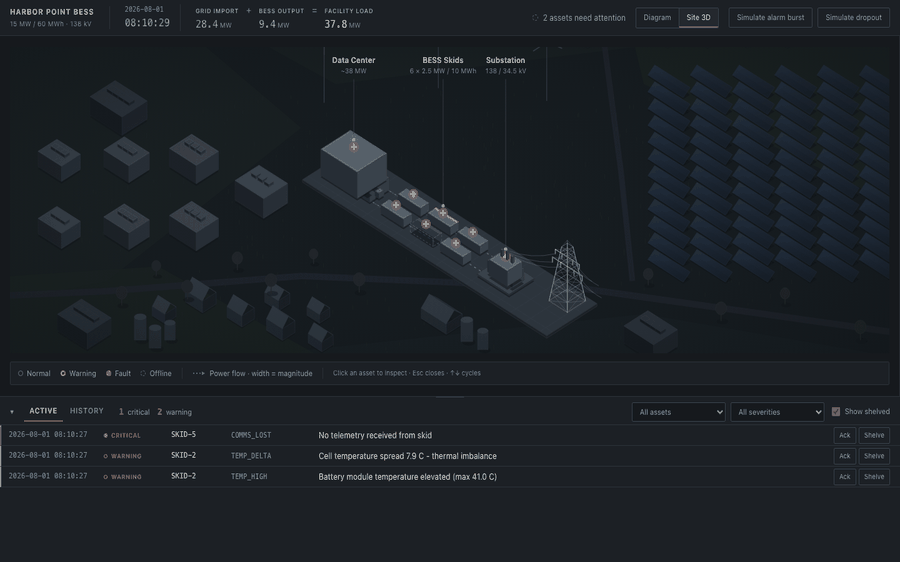

# Interactive Live Site Diagram — BlackTeal frontend exercise

> **Live demo:** _add the deploy URL here before sending_



An operator-facing monitoring view for a grid-connected BESS supporting a ~38 MW data-center
load: a live single-line diagram, per-asset drill-down, and an alarm console built to
High-Performance HMI (ISA-101) conventions.

## Run it

```bash
npm install
npm run dev          # http://localhost:5173
```

```bash
npm test             # 174 tests: pure logic + component/interaction tests
npm run build        # typecheck + production build to dist/
npm run check        # typecheck + lint + tests
```

No backend, no accounts, no database — the live feed is simulated in the browser.

## Two views of the same live state

**Site 3D** (default) — an isometric site plan mirroring the brief's Figure 1: the data-centre hall, six
containerised skids, the substation transformer and the transmission pylon, with an orange "+"
on everything inspectable, set in a continuous landscape — neighbouring data-centre halls,
a solar array running off the frame, service tracks, a hamlet with barns and grain silos, and
wind turbines on the skyline. The land extends far past the view on every side, so
the site reads as part of somewhere rather than a model on a tray. All of it is inert scenery:
aria-hidden, unfocusable, and locked to the neutral tier, so colour and clickability stay
exclusive to the eight real assets. It opens with a reveal — the scene swings from an off-square yaw to
isometric while components arrive back to front — which introduces where each thing physically
stands before any data is read. Status rides the container roof strips, so the physical model answers
"which box do I walk to?" the way the schematic answers "what is connected to what".

**Diagram** — the ISA-101 single-line schematic: how the plant is connected, at the density an
operator monitors from. One click away.

Both are driven by one store — the same alarms, the same drawer, the same selection. Switching
views never changes what is true, only how it is drawn, and the choice is remembered.

The 3D view is plain SVG with a hand-rolled isometric projection, not WebGL. At eight objects a
3D engine would add a dependency, a canvas no screen reader can enter, and a second rendering
model to keep in sync — for a scene that never rotates. Every asset stays a focusable DOM
element with the same accessible name it has in the diagram.

## What to look at first

Everything below happens **unattended within the first minute**, so there's nothing to set up:

| When | What |
|---|---|
| t+0 | The brief's snapshot renders exactly as given — Skid 2 derated and warning, Skid 5 offline |
| ~t+10 s | Skid 2 cools, its warning clears, and its envelope un-derates 1.5 → 2.5 MW |
| ~t+22 s | **Alarm burst** — 15+ alarms across four skids roll into a handful of grouped rows |
| ~t+42 s | Skid 5 reconnects, OFFLINE → NORMAL |

Drag the top edge of the alarm console to resize it (arrow keys work too, when focused), and
your layout is remembered. Both demo triggers are buttons in the top strip: **Simulate alarm
burst** and **Simulate dropout**. These drive the *simulator harness*, not plant equipment — the app itself is strictly
read-only monitoring, with no control actions anywhere. Click a skid to open its drawer; `Esc` closes it and `↑`/`↓` cycle assets.

Worth opening deliberately: **Skid 3** (the brief omits three of its PCS fields — they render
as `—`, never as `0`) and **Skid 5** (fully offline; the panel still opens and explains why
there's no data).

## How it's built

```
src/domain/    types, topology, alarm catalog, initial snapshot — pure data, no React
src/sim/       simulator, rule engine, scenarios, alarm feed — pure functions, no React
src/store/     Zustand store; one simulation tick produces exactly one update
src/components/ diagram (SVG), drawer, alarm console, top strip
```

**The rule engine is a table, not a pile of `if`s.** `evaluateSkid(telemetry)` walks the alarm
catalog and applies thresholds to raw values. Everything else falls out of that: the alarm
message, the derate reason, and the Stage 4 explanation are all built from *the rule that
fired*, so there is no second set of strings to drift out of sync with the thresholds.

**The simulator is deterministic and independently testable.** One tick is `jitter →
scenarios → enforce envelope → re-solve power balance → re-derive alarms`. Grid import is
*solved* from `load − Σ(skid discharge)`, never jittered on its own, and jitter carries a
restoring pull toward each anchor so a long session can't drift a metric out of band and fire
phantom alarms.

**A dropout really stops the feed.** When the feed drops, `simulateFrame` returns the previous
frame untouched — no jitter step, nothing. A banner reading "not live" above numbers that keep
ticking is worse than no banner at all, and it's the first thing anyone testing that button
notices.

**Alarms have hysteresis.** Thresholds fire on the raw limit but only clear once the value has
travelled back past it by a deadband (ISA-18.2 practice). Without this the snapshot's Skid 2 —
whose 8.1 °C spread sits 0.1 above its 8.0 limit — chatters on and off several times a second
from jitter alone, which is exactly the noise Stage 1 exists to eliminate.

**Scenarios move telemetry; they never inject alarms.** To create an alarm the simulator drives
the underlying metric across its threshold and lets the rules fire. A hand-injected alarm would
have no telemetry behind it, so the panel would show an alarm whose metrics look fine.

## Built for operators, not just for the brief

Beyond what the exercise asks for, because the exercise describes a screen someone watches for
a whole shift:

- **Alarm event log.** An active-alarms-only view loses any alarm that fires and self-clears
  between two glances. Every raise, clear, ack and shelve is timestamped and kept (bounded ring
  buffer), site-wide under the History tab and per-asset in the drawer.
- **Time-boxed shelving.** Shelves expire automatically and show a live countdown. An
  indefinite shelve is how an alarm gets permanently lost.
- **Error boundaries.** A render exception shows an explicit "do not treat this as live" panel
  instead of a white page — at the root and around each surface, so one failed panel doesn't
  take the dashboard with it.
- **Alarm rows never reorder under the pointer.** See Scaling notes below.
- **Screen-reader announcements** for newly raised alarms, via an assertive live region.
- **Focus moves into the drawer** when it opens and returns when it closes.
- **Wall clock** in the header; every alarm row and log entry is stamped
  `YYYY-MM-DD HH:MM:SS`, in ISO order rather than a locale format because 03/04 is ambiguous
  between continents and a log is exactly where that becomes a misread incident report.
- **Active and History share one column grid.** They were separate layouts, so `asset` sat at
  32px in one view and 264px in the other and every column jumped when you switched tabs. On a
  panel an operator scans by position, that is a real cost.
- **Every active alarm says when it started** — the onset time is tracked per alarm and
  forgotten when it clears, so a recurrence is timed from its own start.

## Design notes (Stage 2)

The palette was verified numerically rather than eyeballed — the script that checks it lives in
`.claude/references/design-system.md`:

- **Severity is ranked by saturation, not brightness.** Warning is 47% saturated, fault 84% — a
  37-point gap. Red can't out-luminance amber without turning pink, so luminance is spent
  elsewhere (below) and the *saturation* gap carries "which of these is worse."
- **Every state survives a grayscale screenshot.** Perceived-gray ladder 38 / 46 / 53 / 60, so
  the four states stay distinguishable with hue removed — before the icon and text label are
  even considered. Status is always dot **+** form **+** text.
- **Normal is gray, not green.** Six green skids would be six salient regions competing with the
  one amber skid that needs attention. Green appears once, in the legend.
- **Offline is a dashed stroke, not a color** — it's absence of information, not a process state.
- **Only faults animate.** Metric numbers update instantly with no transition; animating every
  jittered decimal creates constant motion, which is itself a violation of "calm dashboard."
- **BlackTeal's brand orange is interaction-only** — selection, focus, the click-to-inspect "+"
  echoing their own Figure 1. Never a status color, because it sits between amber and red and
  would blur the gap above.
- `tabular-nums` on every changing numeral, and `prefers-reduced-motion` honoured throughout.

## Trade-offs, and what I'd do with more time

**System fonts over a self-hosted webfont.** Zero network requests and no FOUT, and SF Mono has
true tabular figures on the reviewer's Mac. The cost is that rendering differs across macOS,
Windows and Linux. With more time I'd self-host IBM Plex Sans + Plex Mono for identical
rendering — it's ~80 KB and worth it in a product, but not worth the setup here.

**No virtualization in the alarm console.** The brief's scale is dozens of rows, not thousands,
so virtualizing would add complexity and break the enter/exit animations for no measurable gain.
At 10k+ rows this would need revisiting.

**Flood grouping threshold is 3, and it's a judgement call.** Below three, individual rows carry
more information than a group — "TEMP_HIGH ×2" tells an operator less than seeing *which* two
skids. Above three it's noise. A real system would make this configurable per code and also
time-window it (group only alarms arriving within N seconds), which is the next refinement.

**Ack clears when the alarm clears; a shelve runs its timer.** A recurring condition should
re-demand attention, so acknowledgement is dropped the moment its alarm clears. Shelving is an
explicit decision and is time-boxed with a visible countdown (60 s here so it's demonstrable in
a review; hours in a real plant). Neither survives a reload — restoring a shelve from a previous
session could hide a live alarm from whoever comes on shift next.

**Severity outranks acknowledgement in the sort.** Acking means "I have seen this", not "this is
less dangerous", so an acknowledged critical still sits above an unacknowledged warning.
Otherwise triaging the top of the list pushes the worst alarm out of view.

**No zoom or pan on the diagram — deliberately.** I built it, then removed it. Zoom/pan is a
map metaphor: it lets an operator navigate *away* from the asset that needs attention, so an
alarming skid can sit off-screen while the counts say the site is fine. On a surface whose only
job is situational awareness that is a safety property, not a missing feature. The diagram
auto-fits instead, and past the smallest readable node size the container scrolls with ordinary
native scrollbars — familiar, keyboard-reachable, and impossible to get lost in. (It also broke
click-to-open: capturing the pointer on the SVG root retargets the click away from the node.)

**History is in-memory only**, 60 samples per asset for the sparklines. Nothing persists across
a reload. A real deployment reads a historian.

**Component tests instead of full E2E.** 174 tests: the pure logic (simulator, rules, alarm
feed, event log) plus 26 component tests driving the real DOM via Testing Library — click an
asset opens its panel, a missing metric renders a dash, a flood groups, Escape closes. These
exist because a zoom feature once broke click-to-open while every logic test stayed green.
Playwright against the built bundle would still be the right next layer.

**What I'd build next, in order:** grouping by *time window* as well as by code; per-subsystem
state on the diagram node, so a PCS fault and a battery fault are distinguishable without
opening the drawer; persisting the event log to a backend so it survives a reload and can be
audited; and Playwright specs against the built bundle to complement the component tests.

## Scaling notes

The demo renders the brief's 8 assets, but the paths that would carry a bigger site are built
and tested rather than assumed:

- **Layout** — the data pack's hand-placed coordinates are honored; a topology *without*
  coordinates goes through `ensureLayout`, which wraps skids into columns. Unit-tested against
  a synthetic 60-skid site: every node placed, no overlaps, fitted view contains everything.
- **Navigation** — the diagram auto-fits; past the smallest readable node size the container
  scrolls natively. Clicking an alarm row scrolls its asset into view and flashes it. There is
  no custom pan/zoom gesture to learn, and nothing to get lost in.
- **Hover stays the same size at any site scale** — the tooltip is a screen-space HTML overlay
  anchored through the fit transform, not an SVG child that would shrink with the diagram.
- **Alarm rows never reorder under the pointer.** The feed re-sorts every second; the rendered
  order freezes while the pointer or keyboard focus is inside the list, and releases when it
  leaves. Without this a row can slide out from under you between reading it and clicking Ack,
  and you acknowledge a different alarm than the one you read. New arrivals are appended rather
  than hidden, so the freeze can never conceal an alarm.
- **Operator layout persists** — console height, collapsed state and filters survive a reload,
  because a screen someone watches for a shift shouldn't reset itself. Acknowledgements and
  shelving deliberately do *not* persist: restoring a shelve from a previous session could hide
  a live alarm from whoever comes on next.
- **Per-tick cost is O(assets)** with memoized nodes, so one changed skid re-renders one node.
  The known cliffs at ~10× scale are listed above (console virtualization, node clustering,
  a historian for trends).

## Domain vocabulary

Used throughout, and defined in `.claude/references/domain-glossary.md`: PCS, IGBT, SoC/SoH,
IMD/insulation, C-rate, operating envelope, derate, headroom, PUE, alarm shelving, HPHMI.

## Source material

`docs/BRIEF.md` is a text extraction of the provided PDF, kept as the source of truth.
`docs/Frontend_Exercise_Interactive_Site_Diagram.pdf` is the original.
